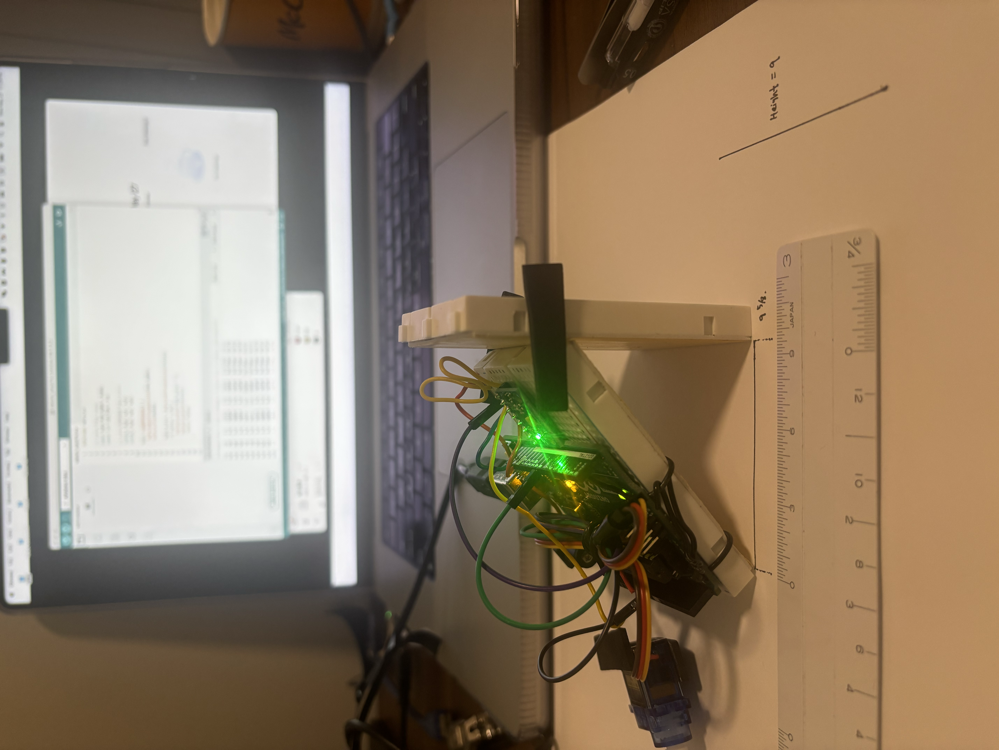
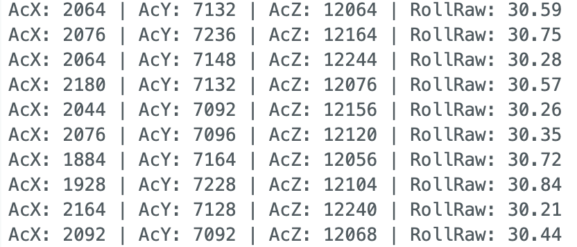

# A Preliminary Test of MPU6050 Roll Angle Measurement under Static Tilt Conditions

## 1. Purpose

The purpose of this experiment was to test whether an MPU6050 sensor could give reasonable roll angle measurements when compared with manually constructed physical tilt angles.

This may seem like a simple question: if I tilt the sensor by a known angle, does the number printed by the Arduino agree with that angle? But this question is actually important for any later use of the sensor. If the sensor cannot give a stable and believable measurement in a static condition, then it would be difficult to trust it in a more complicated motion experiment.

---
## 2. Background
For this experiment, I paid attention to the output of the accelerometer only since a static angle of tilt can be obtained based on the direction of gravity.
If the board is held horizontally, gravity will act along the Z axis. If the board is tilted, a portion of gravity is shifted towards the Y axis. Based on this, the roll angle can be obtained from Y and Z axes' accelerations.

The roll angle was calculated using:

$$
\theta_{roll}=\tan^{-1}\left(\frac{a_y}{a_z}\right)
$$

 $a_y$:accelerometer reading in respect of y axis , $a_z$ : accelerometer reading along z axis.
 
---

## 3. Methods

### 3.1 Hardware

The experiment used:

* Arduino Uno
* MPU6050
* Breadboard and wires
* USB serial monitor
* Physical support structure for different tilt angles
* Engineering scale for measuring height and base length

---

### 3.2 Physical Angle Construction

The physical tilt angles were constructed using measured height and base values. The reference angle was calculated from geometry:

$$\theta=\tan^{-1}\left(\frac{h}{b}\right)$$

where $h$ is the height and $b$ is the base length.

This method is not a laboratory-grade calibration method, but it gives a reasonable physical reference for a preliminary sensor validation experiment. The goal was not to prove the exact angle with perfect certainty, but to compare the sensor reading with a controlled and repeatable physical setup.

Figure 1:experimental setup.

---

### 3.3 Data Collection

Five static tilt conditions were tested:

| Condition      |  Measured with Geometry              | Calculated Physical Angle |
| -------------- | --------------------- | -------------: |
| Flat           | flat                  |           0.0° |
| level 1 incline       | h = 3 2/8, b = 12     |          15.15° |
| level 2 incline    | h = 3 1/8, b = 5 6/8  |          28.52° |
| level 3 incline      | h = 9, b = 9 5/8      |          43.08° |
| level 4  incline  | h = 10 3/8, b = 7 2/8 |          55.05° |

For each angle, I held the setup still and recorded 10 "RollRaw"readings from the serial monitor.
The mean was calculated to estimate the central measured angle:

$$\mu=\frac{1}{N}\sum_{i=1}^{N}x_i$$

The standard deviation was used to estimate how much the readings fluctuated:

$$\sigma=\sqrt{\frac{1}{N}\sum_{i=1}^{N}(x_i-\mu)^2}$$

The mean value was used more as an accuracy tool whereas the standard deviation value indicates stability.
The measurement error was calculated by comparing the mean MPU6050 roll reading with the physical reference angle:

$$
Error=\mu-\theta_{physical}
$$

where $\mu$ is the mean MPU6050 RollRaw value and $\theta_{physical}$is the angle calculated from the measured height and base geometry. A positive error means that the MPU6050 measured angle was larger than the physical reference angle.

---

## 4. Results

The MPU6050 roll readings increased consistently as the physical tilt angle increased. For each condition, ten consecutive "RollRaw" values were recorded from the serial monitor. The mean was used as the sensor’s measured roll angle, and the standard deviation was used to describe the stability of the readings.

| Condition      | Measured with Geometry | Calculated Physical Angle | Mean RollRaw | Standard Deviation |  Error |
| -------------- | --------------------- | -------------:           | -----------: | -----------------: | -----: |
| Flat           | flat                  |           0.0° |                 -0.74° |              0.23° | -0.74° |
| level 1 incline       | h = 3 2/8, b = 12     |          15.15° |                15.48° |              0.26° | +0.33° |
| level 2 incline    | h = 3 1/8, b = 5 6/8  |          28.52° |                30.50° |              0.21° | +1.98° |
| level 3 incline      | h = 9, b = 9 5/8      |          43.08° |                45.69° |              0.25° | +2.61° |
| level 4 incline | h = 10 3/8, b = 7 2/8 |          55.05° |                60.70° |              0.18° | +5.65° |

The readings did not jump around very much within each angle. For example, the standard deviations were all below about 0.3°, so the MPU6050 was fairly steady when the setup was not moving. The larger issue was accuracy at higher angles. The error was small at 15.15°, but it became much larger by the 55.05° setup. This makes me think the sensor itself was repeatable, but my physical setup or sensor alignment may have introduced a consistent bias.

One example serial monitor screenshot is shown below. Additional screenshots are stored in the `figures/` folder.

---

## 5. Discussion

The results suggest that the MPU6050 can measure static roll angle with reasonable accuracy .

The most important observation is not that every value was perfect. No simple manual setup should be expected to produce perfect measurement. The important point is that the measured roll angle changed in the correct direction and stayed close to the physical reference angle across the tested range.

The low standard deviations are also important. If the mean value is close to the physical angle, the sensor is accurate. If the standard deviation is small, the sensor is stable. In this experiment, the readings were highly stable, but the accuracy decreased somewhat at larger tilt angles.

There were still several possible sources of error:

* the physical tilt structure may not have been perfectly aligned
* the height and base measurements may have had small errors
* the MPU6050 may not have been mounted perfectly parallel to the tilted surface
* the table and support structure may not have been perfectly level
* the accelerometer itself may have had a small bias
* the readings were based only on accelerometer data, without advanced filtering

Because of these limitations, this experiment should be understood as a preliminary validation, but still, the result is useful. It shows that the MPU6050 readings are not arbitrary numbers. They have a clear and measurable relationship to the physical angle of the sensor.

This matters for future work. If the MPU6050 can measure static tilt reliably, it may later be used to quantify motion or orientation changes during other sensor measurements, such as MAX30102 signal collection. In that future case, the MPU6050 could help identify whether changes in another sensor signal are caused by actual physiological changes or simply by motion artifact.

---

## 6. Conclusion

This experiment tested the MPU6050’s static roll-angle measurement by comparing Arduino-calculated "RollRaw" values with manually constructed physical tilt angles.

Across five tested conditions, the MPU6050 produced roll measurements that generally followed the approximate physical angles, with increasing positive error at higher tilt angles.

The experiment supports the conclusion that the MPU6050 is suitable for basic static tilt measurement under controlled conditions. It also provides a useful foundation for future motion-related experiments, especially experiments where motion artifacts need to be identified or quantified.
